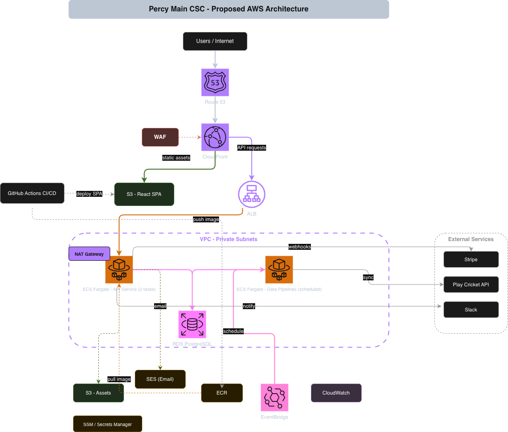

# AWS Migration Proposal

## Current Architecture

We currently run on a mix of third-party services:

| Component | Current Provider | Notes |
|-----------|-----------------|-------|
| **Hosting & CDN** | Netlify | Static site generation + serverless functions, deploy previews per PR |
| **Database** | Turso (libsql/SQLite) | Kysely ORM, per-PR branch databases for previews |
| **Email** | Mailgun | Transactional email (verification, receipts, reminders) |
| **Blob Storage** | Netlify Blobs | File storage for user uploads |
| **Scheduled Jobs** | Netlify Scheduled Functions | External data sync, automated reminders |
| **Edge Functions** | Netlify Edge | Stripe webhook proxy for deploy previews |
| **CMS** | Contentful | Content delivery, preview, and management APIs |
| **Payments** | Stripe | Subscriptions, one-off payments, webhook handling |
| **Auth** | Better Auth (open-source library) | Email/password, Google OAuth, passkeys, 2FA |
| **External Data** | Play Cricket API | Match results, player statistics, league tables |
| **Notifications** | Slack Webhooks | Trustee notifications for payments and enquiries |
| **Maps** | Google Maps API | Venue locations, address lookup |

---

## Proposed AWS Architecture



### Services Replaced

| Component | AWS Service | Replaces |
|-----------|------------|----------|
| **Frontend hosting** | S3 + CloudFront | Netlify |
| **API service** | ECS Fargate + ALB | Netlify serverless functions |
| **Database** | RDS PostgreSQL (db.t4g.micro) | Turso (libsql/SQLite) |
| **Email** | Amazon SES | Mailgun |
| **File storage** | S3 | Netlify Blobs |
| **Scheduled jobs** | EventBridge + ECS | Netlify Scheduled Functions |
| **Secrets** | SSM Parameter Store + Secrets Manager | Environment variables |
| **DNS** | Route 53 | Third-party DNS |
| **Monitoring** | CloudWatch (logs, metrics, alarms) | None (new capability) |
| **Security** | WAF + VPC + Security Groups | None (new capability) |
| **Networking** | VPC + NAT Gateway | Managed by Netlify |
| **Container registry** | ECR | N/A |

### External Services (unchanged)

| Service | Role |
|---------|------|
| **Stripe** | Payment processing (webhook URLs updated to point at ECS) |
| **Play Cricket API** | Cricket match data, player statistics, league tables |
| **Google Maps** | Client-side location services |
| **Slack** | Outbound trustee notifications |

---

## Architectural Improvements

This migration is also an opportunity to modernise our application architecture. The site has grown from a content-focused website into a full application with membership management, payment processing, a fantasy cricket game, and match administration.

### Frontend: Astro → React + Vite SPA

The site currently uses Astro (a static site generator) with React "islands" for interactive features. In practice, ~60% of features by complexity are full React applications wrapped in thin Astro shells. We propose migrating to a **React + Vite single-page application** deployed as static files to S3 and served via CloudFront.

Astro's compatibility with AWS hosting (ECS or Amplify) is an open question that would require significant investigation. React + Vite on S3 is a known quantity with a well-understood deployment model, making it the lower-risk choice.

**Benefits:**
- Single framework — eliminates the Astro/React split and associated complexity
- Shared application state — auth context, data caching, and query providers work across the entire app
- Standard tooling — React Router for client-side routing, Vite for builds
- Simple deployment — static assets on S3, no server-side rendering infrastructure needed

**Trade-off — public content discoverability:** A SPA loses Astro's static-first rendering for public pages (fixtures, results, scorecards, news). Modern search engines handle SPAs well, and our members navigate directly to the site rather than discovering it via search. The main concern is social sharing — link previews on WhatsApp, Slack, and Facebook require Open Graph meta tags to be present in the initial HTML. We solve this with a lightweight CloudFront Function that serves minimal HTML with OG meta tags for social crawlers, without requiring full SSR infrastructure.

### Backend: Serverless Functions → Node.js API Service on ECS

Our backend logic (~9,550 lines across 19 handler files) currently runs inside Astro's serverless action system with no service layer separation. We propose extracting this into a standalone **Node.js API service** running on ECS Fargate.

**Benefits:**
- Service layer reuse — scheduled jobs, webhooks, and the frontend all use the same business logic
- Independent scaling — API scales separately from frontend delivery
- Connection pooling — persistent service enables proper PostgreSQL connection pooling
- Framework-agnostic — frontend can evolve without affecting the backend
- Testable — plain request/response handlers with no framework coupling

### CMS: Contentful → Inline Content

Contentful currently manages ~6 content types via 4 API tokens, 6 npm packages, and a type generation pipeline. Content is edited by a single developer and already requires a deploy to publish (Astro fetches from Contentful at build time). We propose removing Contentful entirely and inlining editorial content directly as React components.

**Benefits:**
- Zero regression in publishing workflow — "edit → commit → deploy" is already the process
- Massively simplified stack — removes external API, 4 tokens, 6 npm packages, and the type generation pipeline
- Content is version-controlled, type-safe, and requires no runtime fetching
- No CMS infrastructure to build or maintain

### Data Pipelines: Monolithic Sync → Decoupled ETL

Our external data ingestion (Play Cricket match results, player statistics) currently runs as a single monolithic background function. We propose separating this into independent, resumable pipeline stages orchestrated by EventBridge.

**Benefits:**
- Decoupled ingestion and serving — external API issues do not affect user experience
- Independent pipeline stages — ingest, scoring, and cache refresh run and fail independently
- Idempotent and resumable — partial failures are recovered automatically on next run
- Observability — structured CloudWatch metrics per pipeline stage

---

## Account Structure

```
Percy Main AWS Organization
├── Production Account
│   ├── VPC + NAT Gateway
│   ├── ECS Fargate (API service, 2 tasks)
│   ├── ALB (API routing + health checks)
│   ├── RDS PostgreSQL (production data)
│   ├── S3 (frontend assets + user uploads)
│   ├── CloudFront (CDN)
│   ├── SES (transactional email)
│   ├── Route 53 (DNS)
│   ├── CloudWatch (monitoring + alerting)
│   └── WAF (application firewall)
│
├── Staging Account
│   ├── VPC + NAT Gateway
│   ├── ECS Fargate (API service, 1 task)
│   ├── ALB
│   ├── RDS PostgreSQL (staging data, seeded from production snapshot)
│   ├── S3 + CloudFront (frontend)
│   └── CloudWatch
│
└── Preview (shared with Staging)
    ├── Per-PR PostgreSQL schemas (within staging RDS instance)
    └── Per-PR S3 prefixes for frontend builds
```

Separate accounts provide blast radius isolation, independent IAM policies, and per-environment cost visibility. We currently have no staging environment — deploy previews are our only pre-production testing.

---

## Key Benefits

| Benefit | Detail |
|---------|--------|
| **Sustainable funding** | AWS non-profit credits would replace personal trustee funding, securing infrastructure long-term |
| **Professional monitoring** | CloudWatch metrics, alarms, and dashboards — currently no monitoring capability |
| **Application security** | WAF, VPC, Security Groups, IAM, encryption at rest |
| **Automated backups** | RDS automated daily snapshots with 35-day point-in-time recovery |
| **PostgreSQL** | Full-text search, JSON operators, window functions, CTEs, mature ecosystem |
| **Environment parity** | Production, staging, and preview environments |
| **Scalability** | Scale ECS tasks, upgrade RDS instance, or add read replicas as membership grows |
| **Consolidated billing** | Single AWS account replaces four separate service subscriptions |
| **Data pipeline resilience** | Decoupled ingestion and serving |
| **Operational maturity** | Structured logging, alerting, and environment isolation |

---

## Broad Timeline

| Phase | Summary | Key Milestone |
|-------|---------|---------------|
| **1. Foundation & Database** | AWS account setup, VPC, RDS, DNS, SES, S3. Migrate database from SQLite to PostgreSQL. | Production database live on RDS |
| **2. Backend Service** | Extract API service, deploy to ECS Fargate behind ALB. Migrate webhooks and scheduled jobs. | API service serving production traffic |
| **3. Data Pipelines** | Decouple external data ingestion into independent ETL stages. | Pipeline logic separated from request path |
| **4. Frontend Migration** | Migrate from Astro to React/Vite SPA. Deploy to S3 + CloudFront. | Full application live on AWS |
| **5. Content Migration** | Inline Contentful content as React components. Remove Contentful dependencies. | Contentful decommissioned |
| **6. Cutover & Environments** | Staging environment. DNS cutover. Decommission old services. | Migration complete |

See [Implementation Plan](./implementation-plan.md) for detailed phase breakdowns and [Cost Breakdown](./cost-breakdown.md) for per-phase cost build-up.
